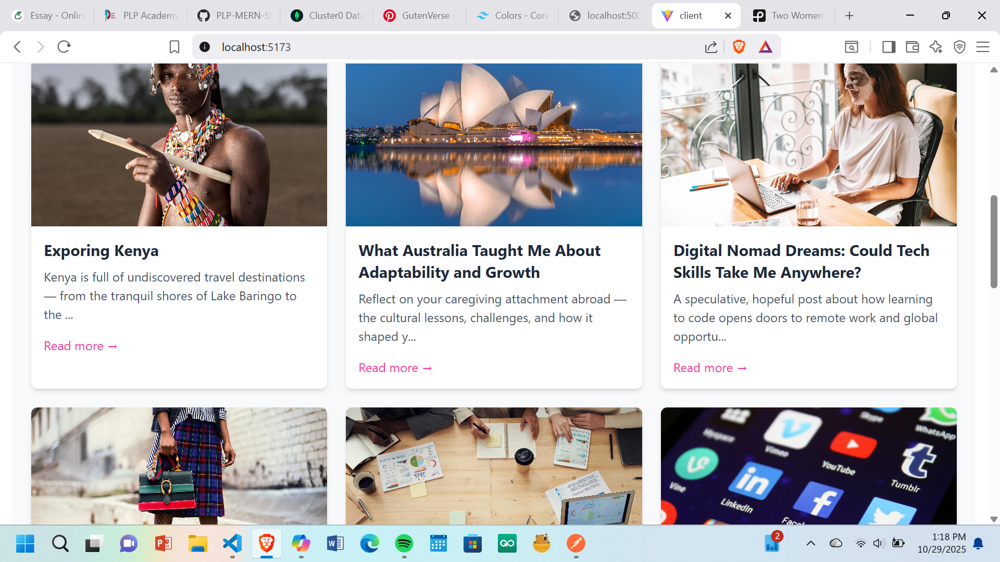

# 📝 Imani.s Blog Platform

**Imani.s** is a full-stack blog application built with the MERN stack (MongoDB, Express, React, Node.js). It’s designed to be a welcoming, community-driven space where users can share posts, explore categories, and engage with meaningful content. The name "Imani" means **faith** — a reflection of the platform’s purpose, resilience, and beauty.

---

## 🚀 Features

- **Create & Read Posts**: Users can write blog posts with rich content and images.
- **Flexible Image Handling**: Supports both direct file uploads and external image URLs.
- **Category Filtering**: Posts are organized by categories like Technology, Education, Lifestyle, Business & Entrepreneurship, and Travel & Culture.
- **Default Author Assignment**: All posts are automatically attributed to the creator (Faith) for now.
- **Responsive UI**: Built with Tailwind CSS for a clean, mobile-friendly experience.
- **Error Handling & Feedback**: Clear alerts and fallback UI for smooth user interaction.

---
## Screenshots
## 🏠 Homepage Preview


## ✍️ Post Creation Form




## 🧰 Tech Stack

| Layer        | Tools Used                          |
|--------------|-------------------------------------|
| Frontend     | React, Vite, Tailwind CSS           |
| Backend      | Node.js, Express                    |
| Database     | MongoDB (Mongoose ODM)              |
| Image Upload | Multer, FormData, Cloudinary-ready  |
| Auth (WIP)   | JWT-based authentication (planned)  |

---

## 📁 Folder Structure
client/  src # React frontend
          └──          
             └── components/ # Reusable UI components 
             └── pages/      # Page views (Home, PostForm, etc.) 
             └── services/   # Axios API calls
             └──hooks/
             └──context/
           App.jsx  
server/      # Express backend 
                └── models/     # Mongoose schemas (Post, Category, User) 
                └── routes/     # API endpoints 
                └── middleware/ # Error handling, auth (future)

---

## 🛠 Setup Instructions

1. **Clone the repo**  
   `git clone https://github.com/Imanikiplagat.git`

2. **Install dependencies**  
   ```bash
   cd client && npm install
   cd ../server && npm install
3  **Configure environment variables**
Create .env files in both client and server folders for API URLs, MongoDB URI, etc.

4. **Run the app**
cd server && npm run dev
cd ../client && npm run dev

✨ Future Enhancements- 🔐 User authentication and role-based access
- 💬 Comment system with moderation
- 📊 Post analytics and engagement tracking
- 🌍 Multi-language support
- 🧑‍🤝‍🧑 Community profiles and post likes
- 
🙋‍♀️ About the CreatorBuilt by Faith, a caregiver turned full-stack developer. Imani.s is a reflection of her journey — combining empathy, design, and technical growth to create a space that feels purposeful and inclusive.📄 LicenseThis project is open-source under the MIT License.
---


   
